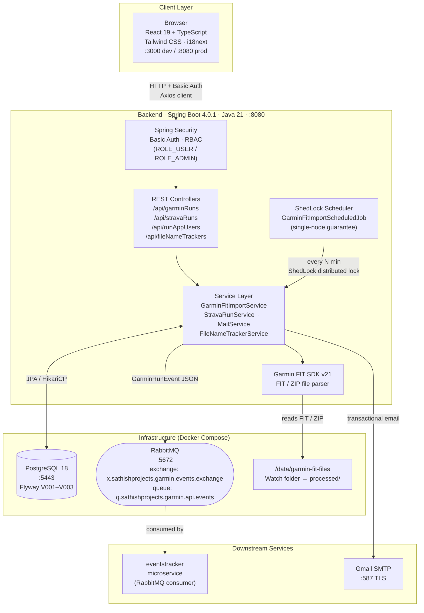
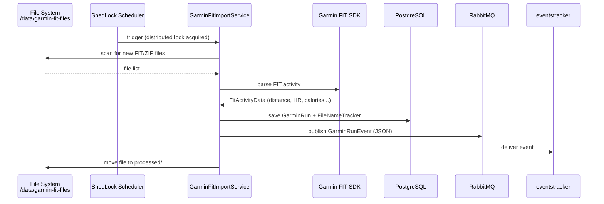

# Runs App

A full-stack running activity tracking application built with Spring Boot 4.0 and React 19. Track, analyze, and visualize your running activities with a modern, responsive web interface backed by a secure REST API with Spring Security.

**Author:** Sathish Jayapal
**Last Updated:** February 2026

## Documentation
- Operational/developer guidance (admin access, CI/CD, Garmin setup, RabbitMQ debugging): `docs/adr/ADR-005-docs-consolidation.md`

---

## Table of Contents

- [Architecture](#architecture)
- [Project Description](#project-description)
- [Tech Stack](#tech-stack)
- [Key Features](#key-features)
- [Prerequisites](#prerequisites)
- [Installation](#installation)
- [Development](#development)
- [Building for Production](#building-for-production)
- [Docker Deployment](#docker-deployment)
- [Testing](#testing)
- [Database Management](#database-management)
- [Project Structure](#project-structure)

---

## Architecture

### System Diagram



### Data Flow: Garmin FIT Import



### Key Architectural Decisions

| Decision | Choice | Why |
|----------|--------|-----|
| Framework | Spring Boot 4.0.1 + Java 21 | Latest LTS; virtual threads ready; ahead of market |
| Frontend | React 19 embedded in JAR | Single deployable artifact; no separate frontend server |
| Messaging | RabbitMQ (not Kafka) | Lower ops overhead for point-to-point event fan-out |
| Scheduling | ShedLock (JDBC) | Safe for future horizontal scaling; no Quartz complexity |
| DB Migrations | Flyway | Version-controlled, reproducible schema changes |
| Auth | Spring Security Basic Auth | Pragmatic for internal tool; swap to OAuth2 when needed |
| Exactly-Once Semantics | RIFL (Park, Stanford) | Guarantee linearizability for critical mutations |
| Cache GC | Lease-based (heartbeat) | Bounded memory, automatic cleanup |

> Full architecture decision records: [`docs/adr/`](docs/adr/)

### RIFL: Exactly-Once Semantics for POST /api/garminRuns

To prevent duplicate activities on client retry (network timeout, browser back-button), we implement **RIFL** (Reusable Infrastructure for Linearizability) from Seo Jin Park's Stanford dissertation.

**How it works:**
1. Client opens a lease: `POST /api/rifl/lease/open` → returns `clientId`
2. Client sends request with RIFL headers: `X-Client-Id`, `X-Sequence-Number`, `X-First-Incomplete`
3. Server caches completion record keyed by `(clientId, sequenceNumber)`
4. Retry with identical headers → cache hit → identical response replayed (no re-execution)
5. Expired leases (60s without renewal) → automatic GC of cached records

**Components:**
- `LeaseManager`: Tracks client heartbeats, detects expiry
- `ResultTracker`: In-memory cache of completion records + per-client watermark
- `RiflFilter`: Intercepts mutations, caches responses
- `RiflGcScheduler`: Periodic cleanup every 30 seconds

**Design choice:** Simplified design (Ch. 3) — cache is in-memory only, relying on PostgreSQL WAL for mutation durability. On JVM crash, cache is lost but mutations are durable; retries are safe due to `UNIQUE(activity_id)` constraint.

See [`ADR-001`](docs/adr/ADR-001-rifl-exactly-once-semantics.md), [`ADR-003`](docs/adr/ADR-003-lease-based-gc.md), [`ADR-004`](docs/adr/ADR-004-simplified-rifl-design.md) for details.

---
- [API Endpoints](#api-endpoints)
- [Configuration](#configuration)
- [Troubleshooting](#troubleshooting)
- [Resources](#resources)

---

## Project Description

**Runs App** is a comprehensive fitness tracking application designed for runners. It combines:
- Backend: Spring Boot 4.0 with Java 21, featuring Spring Security for authentication
- Frontend: React 19 with Tailwind CSS for responsive, modern UI
- Database: PostgreSQL for persistent data storage
- Build Integration: Maven with embedded Node.js for seamless full-stack builds
- Testing: Jest for frontend, JUnit 5 for backend with comprehensive test coverage

The application demonstrates enterprise-grade patterns for building modern single-page applications (SPAs) with RESTful backends, including proper error handling, form validation, and internationalization support.

---

## Tech Stack

### Backend
- **Framework:** Spring Boot 4.0.1
- **Language:** Java 21
- **Build Tool:** Maven 3.8+
- **Database:** PostgreSQL 18
- **ORM:** Spring Data JPA / Hibernate
- **Security:** Spring Security 6.x with JWT support
- **API:** RESTful with proper error handling
- **Flyway:** Database schema migration management
- **Error Handling:** Error Handling Spring Boot Starter 5.0

### Frontend
- **Library:** React 19.2.3 with TypeScript 5.9.3
- **Routing:** React Router 7.11.0 (client-side routing)
- **State Management:** React Hook Form 7.68.0
- **Validation:** Yup 1.7.1 for schema validation
- **HTTP Client:** Axios 1.13.2
- **Styling:** Tailwind CSS 4.1.18 with Forms plugin
- **Internationalization:** i18next 25.7.3
- **UI Components:** Form handling with error display
- **Date Picker:** Flatpickr 4.6.13
- **Testing:** Jest 30.2.0, React Testing Library 16.3.1

### Build & Dev Tools
- **Bundler:** Webpack 5.104.1 with dev server
- **Transpiler:** Babel 7.28.5
- **CSS Processing:** PostCSS with autoprefixer
- **Testing:** Jest with TypeScript support (ts-jest)
- **Frontend Plugin:** Frontend Maven Plugin for integrated builds

---

## Key Features

- **Running Activity Tracking:** Create, update, and delete running session logs
- **Activity Analytics:** View statistics on distance, pace, duration, and elevation
- **Responsive Design:** Mobile-first approach with Tailwind CSS
- **Modern React UI:** Functional components with hooks, no class components
- **Spring Security:** Secure endpoints with JWT authentication
- **Form Validation:** Client-side validation with Yup schemas
- **Internationalization:** Multi-language support via i18next
- **Error Handling:** Comprehensive error handling across frontend and backend
- **Date & Time Management:** Activity logging with precise timestamps
- **Flyway Migrations:** Version-controlled database schema
- **REST API:** Clean, RESTful API following best practices
- **Jest Testing:** Complete frontend unit test coverage

---

## Prerequisites

### System Requirements
- **Java:** JDK 21 or higher
- **Node.js:** Version 24 or higher (auto-downloaded by maven-frontend-plugin)
- **Maven:** 3.8.0 or higher
- **PostgreSQL:** 18 or higher
- **Docker:** Latest version (for running PostgreSQL locally)
- **npm:** Bundled with Node.js

### Development Tools
- **IDE:** IntelliJ IDEA (with Lombok plugin), VS Code, or Eclipse
- **Browser:** Modern browser with React DevTools extension (recommended)
- **Git:** For version control
- **API Testing:** Postman or Insomnia

---

## Installation

### 1. Clone the Repository

```bash
git clone <repository-url>
cd runs-app
```

### 2. Start PostgreSQL with Docker

```bash
# Start PostgreSQL container
docker compose up -d

# Verify PostgreSQL is running
docker compose ps
```

This will start PostgreSQL on port 5443 with:
- **Database:** runs-app
- **Username:** postgres
- **Password:** P4ssword!

### 3. Create Local Configuration

Create `src/main/resources/application-local.yml`:

```yaml
spring:
  datasource:
    url: jdbc:postgresql://localhost:5443/runs-app
    username: postgres
    password: P4ssword!
  jpa:
    hibernate:
      ddl-auto: validate
  flyway:
    locations: classpath:db/migration
```

### 4. Install Frontend Dependencies

```bash
npm install
```

### 5. Verify Installation

```bash
# Test that Maven can build
mvnw --version

# Test that npm is installed
npm --version
```

---

## Development

### Running the Application in IDE

#### IntelliJ IDEA Setup

1. **Install Lombok Plugin:**
   - Settings → Plugins → Search "Lombok" → Install
   - Settings → Build, Execution, Deployment → Compiler → Annotation Processors → Enable annotation processing

2. **Configure Spring Boot Run Configuration:**
   - Run → Edit Configurations
   - Click the "+" button → Spring Boot
   - Set Name: "Runs App"
   - Set Main class: `me.sathish.runsapp.RunsAppApplication`
   - Click "Modify options" → Enable "Add VM options"
   - Add: `-Dspring.profiles.active=local`

3. **Start the Application:**
   - Click Run to start Spring Boot on port 8080

### Starting the React Dev Server

In a separate terminal:

```bash
npm run devserver
```

This will:
- Start Webpack Dev Server on port 3000
- Enable hot module replacement for React components
- Provide live reload for CSS changes
- Proxy API requests to Spring Boot backend on port 8080

### Development Workflow

1. **Backend API Changes:** Modify Java code → Spring Boot hot reload
2. **React Components:** Modify .tsx files → HMR updates browser instantly
3. **Styling:** Modify CSS/Tailwind → Live refresh in browser
4. **Database Schema:** Add Flyway migration → Auto-migrates on startup
5. **Tests:** Run frontend tests with `npm run test`

### Access Points

```
Frontend:        http://localhost:3000
Backend API:     http://localhost:8080
Health Check:    http://localhost:8080/actuator/health
PostgreSQL:      localhost:5443
```

### Frontend Testing

```bash
# Run all Jest tests
npm run test

# Run tests in watch mode
npm run test -- --watch

# Generate coverage report
npm run test -- --coverage
```

---

## Building for Production

### Full Build Process

```bash
# Clean and build everything
mvnw clean package
```

This will:
1. Compile Java backend code
2. Download Node.js (if not cached)
3. Install npm dependencies
4. Run Jest tests
5. Build optimized React bundle with Webpack
6. Run backend integration tests
7. Package executable JAR with embedded React app

### Running the Packaged Application

```bash
# Run with production profile
java -Dspring.profiles.active=production \
  -DJDBC_DATABASE_URL=jdbc:postgresql://prod-host:5443/runs-app \
  -DJDBC_DATABASE_USERNAME=postgres \
  -DJDBC_DATABASE_PASSWORD=prod-password \
  -jar ./target/runs-app-0.0.1-SNAPSHOT.jar
```

The application will be available at `http://localhost:8080`

### Optimized Build

```bash
# Skip tests for faster builds (when needed)
mvnw clean package -DskipTests

# Build with production optimizations
mvnw clean package -Pprod
```

---

## Docker Deployment

### Building Docker Image

```bash
# Create OCI image using Spring Boot plugin
mvnw spring-boot:build-image \
  -Dspring-boot.build-image.imageName=me.sathish/runs-app:latest
```

### Running Container

```bash
# Run with environment variables
docker run -d \
  --name runs-app \
  -p 8080:8080 \
  -e SPRING_PROFILES_ACTIVE=production \
  -e SPRING_DATASOURCE_URL=jdbc:postgresql://postgres:5443/runs-app \
  -e SPRING_DATASOURCE_USERNAME=postgres \
  -e SPRING_DATASOURCE_PASSWORD=prod-password \
  me.sathish/runs-app:latest
```

### Docker Compose for Full Stack

```yaml
version: '3.8'
services:
  postgres:
    image: postgres:18
    environment:
      POSTGRES_DB: runs-app
      POSTGRES_USER: postgres
      POSTGRES_PASSWORD: P4ssword!
    ports:
      - "5443:5432"
    volumes:
      - postgres-data:/var/lib/postgresql/data

  app:
    image: me.sathish/runs-app:latest
    ports:
      - "8080:8080"
    environment:
      SPRING_PROFILES_ACTIVE: production
      SPRING_DATASOURCE_URL: jdbc:postgresql://postgres:5443/runs-app
      SPRING_DATASOURCE_USERNAME: postgres
      SPRING_DATASOURCE_PASSWORD: P4ssword!
    depends_on:
      - postgres

volumes:
  postgres-data:
```

Run with: `docker compose up -d`

### Environment Variables

| Variable | Default | Purpose |
|----------|---------|---------|
| `SPRING_PROFILES_ACTIVE` | `production` | Active Spring profiles |
| `SPRING_DATASOURCE_URL` | - | PostgreSQL connection URL |
| `SPRING_DATASOURCE_USERNAME` | `postgres` | Database username |
| `SPRING_DATASOURCE_PASSWORD` | - | Database password |
| `SERVER_PORT` | `8080` | Application port |

---

## Testing

### Backend Testing

```bash
# Run all backend tests
mvnw test

# Run specific test class
mvnw test -Dtest=RunActivityControllerTest

# Run with detailed output
mvnw test -X
```

### Frontend Testing

```bash
# Run all tests once
npm run test

# Run tests in watch mode (re-run on file changes)
npm run test -- --watch

# Run with coverage report
npm run test -- --coverage

# Run specific test file
npm run test -- RunActivity.test.tsx
```

### Test Structure

```
Backend Tests: src/test/java/
- controller/      (REST endpoint tests)
- service/         (Business logic tests)
- repository/      (Data access tests)

Frontend Tests: src/test/tsx/
- components/      (React component tests)
- utils/           (Utility function tests)
- integration/     (Feature integration tests)
```

### Integration Testing

```bash
# Tests use Testcontainers for PostgreSQL
# Tests run automatically during mvnw test
# Database is isolated per test run

# Clear testcontainers if needed
docker ps -a | grep postgres | grep test | awk '{print $1}' | xargs docker rm
```

---

## Database Management

### Flyway Migrations

Location: `src/main/resources/db/migration/`

#### Creating Migrations

```bash
# Name format: V{version}__{description}.sql
# Example: V001__Create_runs_table.sql
```

#### Sample Migration

```sql
-- V001__Create_runs_table.sql
CREATE TABLE runs (
    id SERIAL PRIMARY KEY,
    user_id BIGINT NOT NULL,
    distance_km DECIMAL(10, 2),
    duration_minutes INT,
    average_pace VARCHAR(10),
    start_time TIMESTAMP NOT NULL,
    end_time TIMESTAMP NOT NULL,
    notes TEXT,
    created_at TIMESTAMP DEFAULT CURRENT_TIMESTAMP,
    updated_at TIMESTAMP DEFAULT CURRENT_TIMESTAMP,
    FOREIGN KEY (user_id) REFERENCES users(id)
);

CREATE INDEX idx_runs_user_id ON runs(user_id);
CREATE INDEX idx_runs_start_time ON runs(start_time);
```

#### Running Migrations

```bash
# Automatic on startup (default)
mvnw spring-boot:run

# Manual execution
mvnw flyway:migrate

# Check migration status
mvnw flyway:info

# Clean database (WARNING: destructive)
mvnw flyway:clean
```

---

## Project Structure

```
runs-app/
├── pom.xml                              # Maven configuration
├── package.json                         # Frontend dependencies
├── webpack.config.js                    # Webpack configuration
├── tsconfig.json                        # TypeScript configuration
├── docker-compose.yml                   # PostgreSQL service
│
├── src/main/
│   ├── java/me/sathish/runsapp/
│   │   ├── config/                      # Spring configuration (Security, etc)
│   │   ├── controller/                  # REST API controllers
│   │   ├── entity/                      # JPA entities
│   │   ├── repository/                  # Spring Data repositories
│   │   ├── service/                     # Business logic
│   │   ├── dto/                         # Data transfer objects
│   │   ├── security/                    # Security configuration
│   │   ├── exception/                   # Custom exceptions
│   │   ├── util/                        # Utility classes
│   │   └── RunsAppApplication.java
│   │
│   └── resources/
│       ├── db/migration/                # Flyway migrations
│       │   └── V001__initial_schema.sql
│       ├── application.yml              # Configuration
│       ├── application-local.yml        # Dev configuration
│       ├── application-production.yml   # Prod configuration
│       └── static/                      # Built React app (generated)
│
├── src/test/
│   ├── java/                            # Backend integration tests
│   └── resources/
│       └── application-test.yml
│
└── frontend/
    ├── src/
    │   ├── components/                  # React components
    │   │   ├── RunActivity.tsx
    │   │   ├── ActivityList.tsx
    │   │   └── Dashboard.tsx
    │   ├── pages/                       # Page components
    │   ├── hooks/                       # Custom React hooks
    │   ├── services/                    # API client utilities
    │   │   └── api.ts                   # Axios setup
    │   ├── utils/                       # Utility functions
    │   ├── styles/                      # CSS/Tailwind files
    │   ├── i18n/                        # Internationalization
    │   ├── App.tsx
    │   └── index.tsx
    ├── __tests__/                       # Jest tests
    ├── package.json
    ├── tsconfig.json
    ├── jest.config.js
    └── webpack.config.js
```

---

## API Endpoints

### Authentication Endpoints

```
POST   /api/v1/auth/register            # Register new user
POST   /api/v1/auth/login               # Login and get JWT token
POST   /api/v1/auth/refresh             # Refresh JWT token
GET    /api/v1/auth/me                  # Get current user profile
```

### Running Activity Endpoints

```
GET    /api/v1/runs                     # List all runs (paginated)
POST   /api/v1/runs                     # Create new run
GET    /api/v1/runs/{id}                # Get specific run
PUT    /api/v1/runs/{id}                # Update run
DELETE /api/v1/runs/{id}                # Delete run

GET    /api/v1/runs/stats               # Get running statistics
GET    /api/v1/runs/stats/month/{month} # Get monthly statistics
```

### Actuator Endpoints

```
GET    /actuator                        # Available endpoints
GET    /actuator/health                 # Health status
GET    /actuator/info                   # Application info
GET    /actuator/metrics                # Application metrics
```

---

## Configuration

### Application Properties

#### Development (`application-local.yml`)

```yaml
spring:
  datasource:
    url: jdbc:postgresql://localhost:5443/runs-app
    username: postgres
    password: P4ssword!
    hikari:
      connection-timeout: 30000
      maximum-pool-size: 10
  jpa:
    hibernate:
      ddl-auto: validate
    show-sql: false
  flyway:
    locations: classpath:db/migration

server:
  port: 8080

logging:
  level:
    root: INFO
    me.sathish: DEBUG
    org.springframework.web: DEBUG
    org.springframework.security: DEBUG

app:
  jwt:
    secret: dev-secret-key-change-in-production
    expiration: 86400000  # 24 hours
```

#### Production (`application-production.yml`)

```yaml
spring:
  datasource:
    url: ${SPRING_DATASOURCE_URL}
    username: ${SPRING_DATASOURCE_USERNAME}
    password: ${SPRING_DATASOURCE_PASSWORD}
    hikari:
      connection-timeout: 30000
      maximum-pool-size: 20
  jpa:
    hibernate:
      ddl-auto: validate
    open-in-view: false
  flyway:
    locations: classpath:db/migration

server:
  port: 8080
  compression:
    enabled: true

logging:
  level:
    root: WARN
    me.sathish: INFO

app:
  jwt:
    secret: ${JWT_SECRET}
    expiration: ${JWT_EXPIRATION:86400000}
```

### React Configuration

#### Environment Variables (.env)

```
REACT_APP_API_BASE_URL=http://localhost:8080/api/v1
REACT_APP_I18N_DEFAULT_LANGUAGE=en
```

---

## Troubleshooting

### PostgreSQL Connection Issues

```
ERROR: org.postgresql.util.PSQLException: Connection refused
```

**Solution:**
```bash
# Start PostgreSQL if not running
docker compose up -d

# Verify connection
psql -h localhost -p 5443 -U postgres -d runs-app
```

### Lombok Not Working

```
ERROR: cannot find symbol - class @Data
```

**Solution:**
1. Install Lombok plugin in IntelliJ
2. Enable annotation processing: Settings → Build, Execution, Deployment → Compiler → Annotation Processors
3. Rebuild project

### React Development Server Not Starting

```
ERROR: Port 3000 is already in use
```

**Solution:**
```bash
# Kill process on port 3000
lsof -i :3000 | grep -v PID | awk '{print $2}' | xargs kill -9

# Or use different port
PORT=3001 npm run devserver
```

### Jest Tests Failing

```
ERROR: Cannot find module '@'
```

**Solution:**
```bash
# Reinstall dependencies
rm -rf node_modules package-lock.json
npm install

# Clear Jest cache
npm run test -- --clearCache
```

### Spring Security 401 Errors

```
ERROR: 401 Unauthorized on API endpoints
```

**Solution:**
```javascript
// Ensure JWT token is sent in API requests
// src/services/api.ts
axios.defaults.headers.common['Authorization'] = `Bearer ${token}`;
```

### Flyway Migration Conflicts

```
ERROR: Checksum mismatch for migration
```

**Solution:**
```bash
# For development only - reset migrations
mvnw flyway:clean flyway:migrate

# In production, create a new migration to fix the issue
```

---

## Development Tips

### React Best Practices

```typescript
// Use functional components with hooks
const RunActivity: React.FC<Props> = ({ activity }) => {
  const [loading, setLoading] = useState(false);
  const form = useForm<RunFormData>();

  return (
    <form onSubmit={form.handleSubmit(onSubmit)}>
      {/* Component content */}
    </form>
  );
};
```

### Form Validation with Yup

```typescript
const schema = yup.object().shape({
  distance: yup.number().required().positive(),
  duration: yup.number().required().positive(),
  date: yup.date().required(),
});

const form = useForm<RunFormData>({
  resolver: yupResolver(schema),
});
```

### API Service Pattern

```typescript
// src/services/api.ts
const runsApi = {
  list: (page = 0, size = 10) =>
    axios.get(`/api/v1/runs?page=${page}&size=${size}`),
  get: (id: number) =>
    axios.get(`/api/v1/runs/${id}`),
  create: (data: RunFormData) =>
    axios.post('/api/v1/runs', data),
  update: (id: number, data: RunFormData) =>
    axios.put(`/api/v1/runs/${id}`, data),
  delete: (id: number) =>
    axios.delete(`/api/v1/runs/${id}`),
};
```

### Spring Security Configuration

```java
@Configuration
@EnableWebSecurity
public class SecurityConfig {
  @Bean
  public SecurityFilterChain filterChain(HttpSecurity http) throws Exception {
    http
      .authorizeHttpRequests(auth -> auth
        .requestMatchers("/api/v1/auth/**").permitAll()
        .anyRequest().authenticated())
      .sessionManagement(session -> session
        .sessionCreationPolicy(SessionCreationPolicy.STATELESS))
      .addFilterBefore(jwtFilter(), UsernamePasswordAuthenticationFilter.class);
    return http.build();
  }
}
```

---

## Resources

### Official Documentation
- [Spring Boot 4.0 Documentation](https://docs.spring.io/spring-boot/docs/current/reference/htmlsingle/)
- [Spring Security Documentation](https://spring.io/projects/spring-security)
- [Spring Data JPA Reference](https://docs.spring.io/spring-data/jpa/reference/jpa.html)
- [React 19 Documentation](https://react.dev/)

### Frontend Technologies
- [TypeScript Handbook](https://www.typescriptlang.org/docs/)
- [React Router Documentation](https://reactrouter.com/)
- [React Hook Form Documentation](https://react-hook-form.com/)
- [Tailwind CSS Documentation](https://tailwindcss.com/)

### Backend & Database
- [PostgreSQL Documentation](https://www.postgresql.org/docs/)
- [Flyway Database Migrations](https://flywaydb.org/documentation/)
- [Axios HTTP Client](https://axios-http.com/)

### Testing
- [Jest Documentation](https://jestjs.io/)
- [React Testing Library](https://testing-library.com/react)
- [Spring Boot Testing Guide](https://spring.io/guides/gs/testing-web/)

### Learning Resources
- [Maven Documentation](https://maven.apache.org/)
- [Webpack Documentation](https://webpack.js.org/)
- [Spring Boot in Action](https://www.manning.com/books/spring-boot-in-action)

