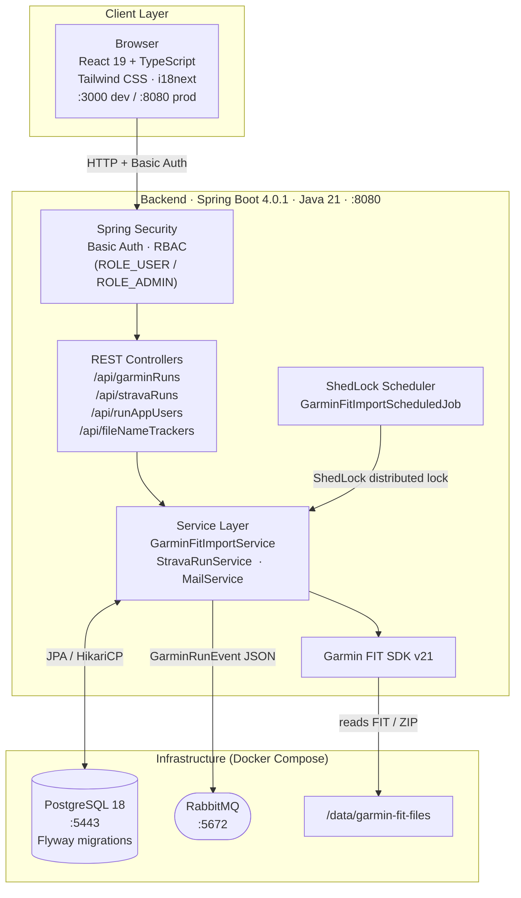

# Runs App

Full-stack running activity tracker — Spring Boot 4.0.1 + React 19 + PostgreSQL.

**Author:** Sathish Jayapal

---

## Architecture



### Key Architectural Decisions

| Decision | Choice | Why |
|----------|--------|-----|
| Framework | Spring Boot 4.0.1 + Java 21 | Latest LTS; virtual threads ready |
| Frontend | React 19 embedded in JAR | Single deployable artifact |
| Messaging | RabbitMQ | Lower ops overhead for point-to-point fan-out |
| Scheduling | ShedLock (JDBC) | Safe for horizontal scaling |
| DB Migrations | Flyway | Version-controlled schema changes |
| Auth | Spring Security Basic Auth | Pragmatic for internal tool |
| Exactly-Once | RIFL (in-memory cache) | Prevent duplicate runs on retry |

See [`docs/adr/`](docs/adr/) for full architecture decision records.

---

## Quick Start

```bash
# Start PostgreSQL
./dev-up.sh

# Terminal 1 — backend
./mvnw spring-boot:run -Dspring-boot.run.profiles=local

# Terminal 2 — frontend dev server
npm run devserver
```

| Service | URL |
|---------|-----|
| Frontend | http://localhost:3000 |
| Backend API | http://localhost:8080 |
| Health | http://localhost:8080/actuator/health |
| PostgreSQL | localhost:5443 |

---

## Development

```bash
# Build (skip tests)
./mvnw clean package -DskipTests

# Run all tests
./mvnw test

# Frontend tests
npm run test

# Reset DB to clean state
./dev-up.sh --reset
```

### Garmin SDK setup (first time only)

```bash
./setup-garmin-sdk.sh
```

---

## API Endpoints

```
# Garmin runs
GET    /api/garminRuns
POST   /api/garminRuns
PUT    /api/garminRuns/{id}
DELETE /api/garminRuns/{id}

# Strava runs
GET    /api/stravaRuns
POST   /api/stravaRuns

# Users
GET    /api/runAppUsers
POST   /api/runAppUsers

# RIFL (exactly-once semantics)
POST   /api/rifl/lease/open
PUT    /api/rifl/lease/{clientId}/renew

# Actuator
GET    /actuator/health
```

---

## Production Build

```bash
./mvnw clean package
java -Dspring.profiles.active=production \
  -DJDBC_DATABASE_URL=jdbc:postgresql://host:5443/runs-app \
  -DJDBC_DATABASE_USERNAME=postgres \
  -DJDBC_DATABASE_PASSWORD=<password> \
  -jar target/runs-app-*.jar
```
